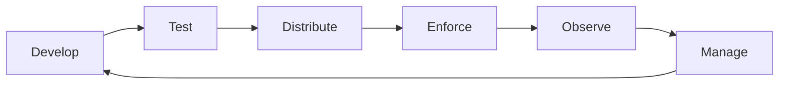

# Namespaces-as-a-Service with Policy as Code (PaC)

This repository contains a demo of self-service namespaces using GitOps and Policy as Code (PaC).

ArgoCD is used for GitOps and Kyverno is used for policy and governance.



## Installation

Install and Configure ArgoCD

1. Create a `hub` cluster

```sh
kind create cluster --name hub
```

2. Install and configure Kyverno

Install latest Kyverno (not recommended for production):

```sh
kubectl create -f https://github.com/kyverno/kyverno/raw/main/config/install-latest-testing.yaml
```

Install Kyverno policies for the `hub` cluster:

```sh
kubectl apply -f config/policies/
```

3. Install and configure ArgoCD

```sh
kubectl create namespace argocd
kubectl apply -n argocd -f https://raw.githubusercontent.com/argoproj/argo-cd/stable/manifests/install.yaml
```

```sh
kubectl patch svc argocd-server -n argocd -p '{"spec": {"type": "LoadBalancer"}}'
```

```sh
kubectl -n argocd get secret argocd-initial-admin-secret -o jsonpath="{.data.password}" | base64 -d; echo
```

```sh
kubectl port-forward svc/argocd-server -n argocd 8080:443
```

```sh
 argocd login 127.0.0.1:8080 --username admin --password <SECRET>
```

Navigate to: https://127.0.0.1:8080/

Login through argocd cli

```sh
argocd login localhost:8080 --username admin --password <SECRET>
```

Updated the ArgoCD ConfigMap to track resources based on annotations. 
This is required to clean up self-service namespaces:

https://github.com/argoproj/argo-cd/issues/7875#issuecomment-1954504713

```sh
kubectl -n argocd patch configmap argocd-cm --type merge -p '{"data":{"application.resourceTrackingMethod": "annotation+label"}}'
```

Install ArgoCD application sets

```sh

```

3. Create a shared cluster

```sh
./config/kind/create.sh
```

```sh
kind create cluster --name shared1 --config /tmp/kind-config.yaml
```

## Cleanup

Demonstrations of secure self-service for Kubernetes Namespaces
